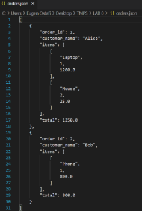

Ministry of Education, Culture and Research of the Republic of Moldova

Technical University of Moldova

Department of Software and Automation Engineering

**REPORT**

Laboratory work No. 0

**Discipline**: Techniques and Mechanisms of Software Design

Elaborated:							   	  FAF-222, 

Ostafi Eugen

Checked:					 			      asist. univ., 

Furdui Alexandru

Chișinău 2024

**Topic: SOLID Principles**

**Task:** Implement 2 SOLID letters in a simple project.

**Theory**

The SOLID principles are a collection of design guidelines that aim to enhance the maintainability, scalability, and robustness of software systems. Introduced by Robert C. Martin, these principles are widely adopted in object-oriented programming. The five SOLID principles include:

1. **Single Responsibility Principle (SRP)**: A class should have only one reason to change, meaning it should only have one responsibility.
1. **Open/Closed Principle (OCP)**: Software entities should be open for extension but closed for modification, allowing new functionality to be added without altering existing code.
1. **Liskov Substitution Principle (LSP)**: Subtypes should be substitutable for their base types without affecting the correctness of the program.
1. **Interface Segregation Principle (ISP)**: Clients should not be forced to depend on interfaces they do not use, promoting smaller and more specific interfaces.
1. **Dependency Inversion Principle (DIP)**: High-level modules should not depend directly on low-level modules; both should depend on abstractions, fostering loose coupling.

Each of these principles targets specific aspects of software design, ensuring that the codebase is flexible and resilient to change.

**Introduction**

In this project, I developed a simple product management system to illustrate the practical application of two SOLID principles: the Single Responsibility Principle (SRP) and the Open/Closed Principle (OCP). This system provides functionality for managing products and generating reports in various formats, such as text and JSON.

The SRP was applied to ensure that each class in the system has a well-defined and singular responsibility. In contrast, the OCP was implemented to allow the addition of new report formats without modifying the existing report generation logic. This design approach enhances the maintainability and extensibility of the system, making it easier to adapt to future requirements.
###
**

--

**SRP IMPLEMENTATION**

The **Single Responsibility Principle (SRP)** states that a class should have only one reason to change, meaning it should focus on a single responsibility. In this project, the SRP is applied through the Order class and the OrderManager class.

The Order class is responsible solely for storing order-related data. It holds details such as the order ID, the customer's name, and a list of items (products) included in the order. Each item is represented as a tuple containing the product name, quantity, and price. By limiting the responsibility of this class to solely holding order data, we ensure that changes related to order representation do not impact other parts of the system.

The OrderManager class is responsible for managing a collection of orders. It provides methods to add new orders and retrieve the current list of orders. This class does not concern itself with the details of how orders are represented or processed, maintaining a clear separation of concerns in line with SRP.

**OCP Implementation**

Following the **Open/Closed Principle (OCP)**, our system is designed to be open for extension but closed for modification. This means we can add new features (like additional report formats) without altering existing code.

The OrderRepository class demonstrates this principle by providing methods to save and load orders while keeping the report generation logic separate.

**OrderRepository Class**

The OrderRepository class is responsible for persisting order data. It contains static methods to save orders to a file and load orders from a file. By separating the concerns of data management and report generation, we can introduce new report formats without modifying the existing repository methods.

1. **Saving Orders to a File**: The save\_orders\_to\_file method accepts a list of orders and writes them to a specified file in a structured format (e.g., JSON). This allows for future extensions, such as adding support for different file formats.
   
1. **Loading Orders from a File**: The load\_orders\_from\_file method reads orders from a specified file and reconstructs Order instances. This enables the system to load existing orders easily without requiring changes to how orders are stored.
   

And here is an example of some results we can obtain using this system:

**CONCLUSION**

In summary, by adhering to both the Single Responsibility Principle (SRP) and the Open/Closed Principle (OCP), our Customer Order System maintains a well-defined scope of responsibility and is designed for future extensibility. This structured approach not only enhances code clarity and maintainability but also simplifies the process of adding new features or modifying existing functionality, ensuring a robust and flexible design.

